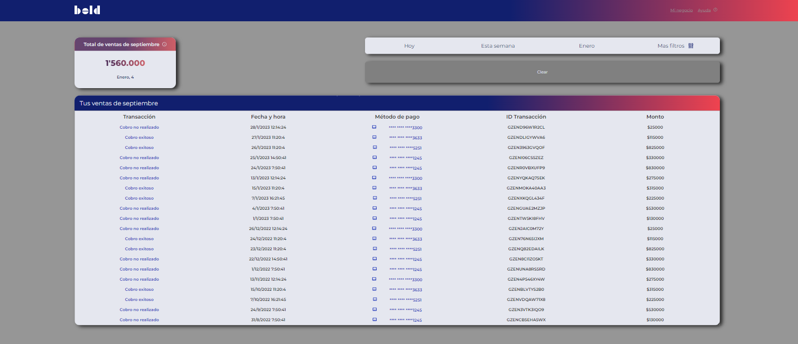
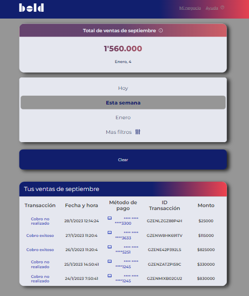
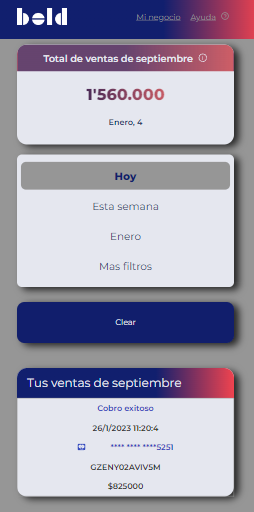

# Proyecto: Aplicación de lista de tareas

Este es un proyecto simple de una aplicación que contiene una lista de transacciones construida con React.js.
La aplicación permite a los usuarios leer y filtrar la información de las transacciones por:

- Dia actual
- Semana actual
- Mes actual
- Transacciones realizadas con datafono
- Transacciones realizadas por medio de link

## Configuración y despliegue

1. Asegúrate de tener Node.js y npm instalados en tu computadora.
2. Descarga o clona el repositorio en tu computadora.
3. En la carpeta del proyecto, ejecuta el comando `npm install` para instalar todas las dependencias.
4. Ejecuta el comando `npm start` para iniciar la aplicación en modo desarrollo.
5. Accede a la aplicación en tu navegador en la dirección `http://localhost:3000/`.

## Librerias

Este proyecto utiliza las siguientes librerías:

- <b>commitlint</b>: Valida y normaliza los mensajes de commit en un proyecto de Git
- <b>commitizen</b>: Estandarizado de commits
- <b>eslint</b>: Linting codigo
- <b>prettier</b>: Formateo codigo
- <b>prettier</b>: Formateo codigo
- <b>vite</b>: Servidor de desarrollo

## Uso de la aplicación

- Para filtrar una transaccion por dia actual, semana actual o mes actual has click en cualquiera de los botones correspondientes.
- Para ver detalles mas filtros has click en el boton "Mas filtros".
- Para filtrar de acuerdo al metodo de pago, selecciona cualquiera de las dos opciones correspondientes.
- Para eliminar los filtros has click en el boton "Clear"
- En la parte inferior de la pantalla se renderiza la informacion de las transacciones.

## Screenshots

### Desktop

    

### Tablet

    

### Mobile

    

## Licencia

Este proyecto está licenciado bajo la licencia MIT.

## Contacto

Si tienes preguntas o problemas con el proyecto, contáctame en [click aqui](mailto:danielmark999@gmail.com)

## Contribuidores

- [BNAStudio](https://github.com/BNAStudio)

## Recursos

- [Repositorio](https://github.com/BNAStudio/REACT-test_frontend_BOLD)

## Argumentacion

### Eleccion tecnologias:

React es una librería que proporciona una gran cantidad de herramientas y características para ayudar a crear interfaces de usuario avanzadas, con un gran rendimiento y escalabilidad, además de una gran comunidad y documentación.

### TODO:

1. Por cuestiones de tiempo no fue posible terminar de crear la funcionalidad para que la informacion fuera persistente.
2. Se implemento CSS puro por cuestiones de tiempo, sin embargo, SASS hubiera sido una eleccion apropiada, puesto que se podrian haber configurados MIXIN's ahorrando lineas de codigo, sin embargo, requeria tiempo la configuracion inicial.
3. Se podria implementar la libreria storybook para la visualizacion de los elementos de la interfaz.
4. Se podria implementar pruebas unitarias y de integracion con JEST o CYPRESS.
5. Con mas tiempo hubiese sido posible refactorizar el codigo para hacerlo mas eficiente y compacto.

### BUGS detectados:

Debido a que no se alcanzo a finalizar la funcionalidad del sessionStorage, es necesario actualizar la pagina la primera vez, para que se renderice la DATA de las transacciones. Posiblemente se debe a que el hook | useDatabase | implementa el hook | useSessionStorage | y la informacion que retorna del hook | useDatabas | proviene directamente del almacenamiento en cache. En la primera carga no existe data en el almacenamiento, por lo que es necesario refrescar la pagina para cargar la info.
